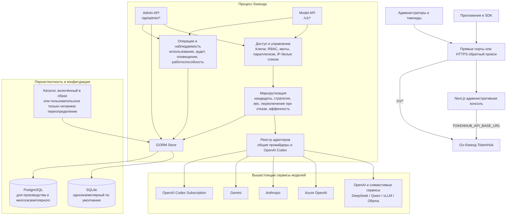
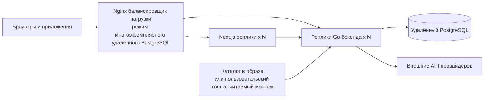

# Архитектура TokenHub

Язык: [English](../architecture.md) | [简体中文](../zh-CN/architecture.md) | [日本語](../ja/architecture.md) | Русский

Этот документ описывает архитектуру, реализованную в этом репозитории, для разработчиков, операторов и команд безопасности. TokenHub по умолчанию использует одноэкземплярное развёртывание SQLite и также поддерживает одноэкземплярный PostgreSQL и многоэкземплярные развёртывания на основе удалённого PostgreSQL.

## Обзор

Go-бэкенд размещает Admin API, API моделей, совместимый с OpenAI, маршрутизацию, адаптеры провайдеров, аудит и персистентность в одном процессе. Next.js-приложение является административной консолью. Плоскость управления и плоскость данных — логические границы: по умолчанию они используют один бэкенд и базу данных, тогда как многоэкземплярные развёртывания используют общее состояние через PostgreSQL.



## Плоскости

| Плоскость | Точки входа и пользователи | Ответственности | Текущая реализация |
| --- | --- | --- | --- |
| Плоскость управления | Административная консоль и `/api/admin/*` | Провайдеры, ресурсы, модели, маршруты, проекты, пользователи, ключи, квоты, оповещения, одобрения и резервные копии | Next.js-консоль и Go Admin API; состояние хранится в SQLite или PostgreSQL |
| Плоскость данных | Приложения и `/v1/*` | Проверка API-ключей проектов, выбор маршрутов, вызов вышестоящих моделей, возврат совместимых ответов | Go `net/http`; Chat Completions, Responses, потоковый Responses, `/v1/responses/compact` и Embeddings |
| Плоскость операций | Зонды, Admin API, инструменты развёртывания | Аудит запросов, использование, попытки маршрутов, зонды провайдеров, резервные копии и координация кластера | Работает в процессе бэкенда; PostgreSQL сохраняет состояние координации для многоэкземплярных развёртываний |

## Режимы развёртывания

| Режим | Compose-файл | Сервисы и входящий трафик | База данных и граница |
| --- | --- | --- | --- |
| Одноэкземплярный по умолчанию | `deploy/docker-compose.yml` | Один фронтенд и один бэкенд; публикует `3000` и `8080` напрямую | SQLite для разработки, тестирования и частных развёртываний на одном хосте |
| Одноэкземплярный PostgreSQL | `deploy/docker-compose.postgres.yml` | Один фронтенд, один бэкенд и локальный PostgreSQL | PostgreSQL для производственных нагрузок, требующих более высокого параллелизма или управления базой данных |
| Многоэкземплярный удалённый PostgreSQL | `deploy/docker-compose.remote-postgres.yml` | Nginx плюс масштабируемые реплики фронтенда и бэкенда | Управляемый PostgreSQL для высокой доступности и горизонтального масштабирования |



Стандартный Compose-файл не имеет обратного прокси и открывает порты фронтенда и бэкенда напрямую. Производственное развёртывание может разместить перед ним HTTPS-терминацию. Compose-развёртывание удалённого PostgreSQL включает Nginx и маршрутизирует `/api/*`, `/v1/*`, `/livez`, `/readyz` и `/healthz` к репликам бэкенда.

Стандартный образ использует каталог моделей, включённый во время сборки, поэтому исполняемый файл и каталог разделяют одну версию. Пользовательский каталог — это явное переопределение через `./deploy/install.sh --model-catalog /absolute/path/to/model-catalog.yaml`; это не стандартный Compose-монтаж.

## Компоненты и провайдеры

| Компонент | Расположение | Ответственность |
| --- | --- | --- |
| Административная консоль | `frontend/` | Ролеосознанная консоль; читает адрес своего бэкенда во время выполнения из `TOKENHUB_API_BASE_URL`, при этом `NEXT_PUBLIC_API_BASE_URL` сохраняется только как запасной вариант совместимости |
| HTTP-сервер | `backend/internal/server/http.go` | API, аутентификация, маршрутизированные вызовы, ответы и эндпоинты работоспособности |
| Маршрутизация | `backend/internal/server/http.go` | Упорядочивание кандидатов по приоритету, приоритету ресурса, стратегии, весу и аффинности |
| Реестр адаптеров и интеграционный сервис | `adapter_registry.go`, `integration_service.go` | Объявляет возможности провайдера и выполняет зонды провайдера/ресурса |
| Адаптеры провайдеров | `providers.go`, `provider_account_codex.go` | Трансляция протоколов; OAuth, обновление и аффинность сессий подписки Codex |
| Store | `store.go` | Доступ GORM, квоты, шифрование учётных данных, резервные копии SQLite, аренды PostgreSQL и кластерные блокировки |

| Тип провайдера | Адаптер и возможности |
| --- | --- |
| `openai`, `openai_compatible`, `qwen`, `local` | Совместимый с OpenAI: Chat, потоковый Chat, Responses, Embeddings и зонды |
| `deepseek` | Совместимый с OpenAI; Chat, потоковый Chat, Embeddings и зонды. Responses и потоковый Responses ограничены моделями и включены для `deepseek-v4-flash` и `deepseek-v4-pro` |
| `azure_openai` | Chat, потоковый Chat, Embeddings и зонды |
| `anthropic` | Chat, потоковый Chat и зонды |
| `gemini` | Chat, потоковый Chat, Embeddings и зонды |
| `openai_codex` | OpenAI Codex Subscription: Responses, потоковый Responses, модели, квоты, OAuth, аффинность сессий и Compact |
| `mock` | Встроенный адаптер для локальной проверки и тестов |

## Поток запроса к модели

`Model` — это внешний API-контракт, `ProviderModel` — постоянный элемент инвентаря вышестоящего сервиса для одного провайдера, а `ModelRoute` отображает между ними. Внешние модели несут явную постоянную роль каталога, поэтому удаление их последнего маршрута оставляет их черновиками вместо превращения обратно в шаблоны кандидатов. Создание и редактирование маршрутов требуют, чтобы выбранная `ProviderModel` существовала в инвентаре. Узким исключением является виртуальная модель `codex-gpt-image-2` на базе подписки: её маршрут должен указывать на провайдера OpenAI Codex и фиксированную вышестоящую модель `gpt-image-2`, которая является возможностью выполнения, а не элементом инвентаря чат-моделей. Это позволяет создать маппинг 1:1 с тем же именем или пользовательский псевдоним без раскрытия специфичных для провайдера имён моделей вызывающим. `POST /v1/chat/completions`, `POST /v1/responses`, `POST /v1/responses/compact` и `POST /v1/embeddings` используют одну и ту же точку входа аутентификации, квот и маршрутизации.

```mermaid
sequenceDiagram
    participant C as Приложение
    participant G as TokenHub /v1
    participant S as Store и база данных
    participant A as Адаптер провайдера
    participant U as Вышестоящий сервис модели

    C->>G: Bearer API-ключ проекта и запрос модели
    G->>S: Проверить ключ, проект, истечение и IP-белый список
    G->>G: Пересечь доступ к моделям проекта и API-ключа
    G->>S: Загрузить применимые политики безопасности контента как один снимок
    G->>G: Проверить, аудировать, маскировать или блокировать видимый пользователю текст запроса
    G->>S: Проверить квоты и аренду параллелизма; создать контекст вызова
    G->>S: Запросить активные и работоспособные Provider / Resource / Route
    G->>G: Разрешить политику API Key, Project или Global; отфильтровать кандидатов
    G->>G: Спланировать попытки из стратегии, весов и аффинности сессий
    loop Маршруты кандидатов с возможностью переключения при отказе
        G->>A: Нормализованный запрос и выбор маршрута
        A->>U: Запрос по протоколу провайдера
        U-->>A: Ответ или ошибка
        A-->>G: Нормализованный ответ, использование, заголовки или ошибка
    end
    G->>S: Сохранить попытки, журналы, использование и состояние ресурса
    G-->>C: Совместимый ответ и x-request-id
```

Неактивные или неработоспособные провайдеры, ресурсы и маршруты пропускаются, с одним исключением: ресурс, у которого истёк период охлаждения, возвращается как кандидат в полуоткрытом состоянии. Первый запрос, достигающий его, занимает пробу, перемещая дедлайн периода охлаждения вперёд, поэтому параллельные запросы всё ещё отклоняются, а неудачная проба уже вооружила следующее, более длинное окно. Только успех самой пробы закрывает автоматический выключатель и восстанавливает ресурс без действий администратора — запрос, уже находившийся в обработке при срабатывании выключателя, не может его воскресить. Повторные сбои расширяют окно экспоненциально до `TOKENHUB_RESOURCE_COOLDOWN_MAX_SECONDS`. Ресурс, отключённый администратором, никогда не возвращается. Непотоковые вызовы пробуют кандидатов по порядку. Поток не может безопасно переключить вышестоящий сервис после начала вывода; потоковый Responses требует адаптера с возможностью `response_stream`. Маршруты `openai_codex` могут выводить ключ аффинности сессии из запроса и API-ключа, затем сохранять привязку ресурса для непрерывности.

Для `POST /v1/responses` с `background: true` синхронный поток запроса останавливается после аутентификации и долговечной отправки. Каждая реплика опрашивает долговечную очередь даже когда она была пустой при запуске. Воркер занимает задание, повторно проверяет его исходную авторизацию и фиксирует принятую фазу, ID запроса, счётчики квот, резервирование токенов и аренду параллелизма в одной транзакции базы данных перед входом в тот же поток защиты, маршрутизации, провайдера, измерения, аудита и трассировки. Эпоха аренды огораживает устаревших воркеров. PostgreSQL использует блокировки строк с `SKIP LOCKED` по репликам; SQLite использует атомарное занятие в поддерживаемом развёртывании с единственным бэкендом. Потеря аренды до принятия воспроизводима, тогда как потеря аренды после принятия является терминальной, а не рискует дублированием запроса провайдера; незадействованное резервирование токенов возвращается при восстановлении.

Доступ к моделям проекта и API-ключа — это явный слой минимальных привилегий перед выбором маршрута: ограниченные списки пересекаются, а ограниченный-пустой запрещает всё, тогда как устаревшие пустые режимы остаются унаследованными. Ограниченные политики маршрутизации хранятся как аудированные записи `AdminResource` типа `routing-policies`. Среда выполнения выбирает не более одной привязки со строгим приоритетом API Key → Project → Global, затем пересекает её ограничения провайдера, ресурса, модели, тега, региона и среды с областью проекта маршрута. Привязка более высокого приоритета, которая отключена, конфликтует или пуста, завершается отказом. Переопределения стратегии, аффинность, полуоткрытое восстановление и переключение при отказе работают только с отфильтрованными кандидатами. Эффективный ID политики, область и приоритет копируются в записи аудита запросов.

## Безопасность, работоспособность и границы данных

- API-ключи проектов проверяются по хэшу, статусу, состоянию проекта, истечению, области моделей, IP-белому списку, квоте и параллелизму.
- Административные вызовы используют токен сессии входа или необязательный `TOKENHUB_ADMIN_TOKEN`. Начальный аккаунт `admin` использует `TOKENHUB_BOOTSTRAP_ADMIN_PASSWORD` при настройке; иначе TokenHub генерирует пароль, чья зашифрованная извлекаемая копия удаляется после первого входа или сброса.
- Запуск вне разработки отключает известные заполнители для необязательных учётных данных начальной загрузки и отклоняет другие слабые непустые значения. `TOKENHUB_SECRET_KEY` остаётся обязательным, кроме новой файловой SQLite-базы данных, которая получает постоянный файл ключа рядом с базой данных. Существующие базы данных никогда не получают замену ключа автоматически.
- `TOKENHUB_TRUSTED_PROXY_CIDRS` определяет, какие прокси могут предоставлять `X-Forwarded-For`, `X-Forwarded-Host` и `X-Forwarded-Proto`; доверенные прокси должны перезаписывать эти заголовки. `TOKENHUB_CORS_ALLOWED_ORIGINS` управляет учётными источниками браузера.
- `/livez` — зонд живости процесса. `/readyz` и совместимый `/healthz` проверяют доступность базы данных и состояние эволюции базы данных: они возвращают `503`, когда база данных недоступна, миграция грязная или проверка реестра не удалась, или блокирующее заполнение данных не завершено. Ожидающие онлайн-заполнения сохраняют готовность экземпляра. Небезопасная конфигурация запуска также сохраняет только `/livez` работоспособным, тогда как все маршруты готовности и приложения возвращают `503` до исправления конфигурации и перезапуска процесса.

Учётные данные провайдеров, учётные данные биллинговых коннекторов, сырые биллинговые снимки и постоянные фоновые нагрузки Responses шифруются AES-GCM из `TOKENHUB_SECRET_KEY`; API-ключи проектов сохраняют только SHA-256 дайджест плюс отображаемый префикс и суффикс. Каждая реплика должна использовать один и тот же стабильный секрет.

| Категория | Ключевые сущности | Назначение |
| --- | --- | --- |
| Аренды и учётные данные | `Project`, `APIKey`, `AdminUser`, `AdminSession` | Владение проектом, доступ приложений и административные сессии |
| Маршрутизация | `Provider`, `ProviderResource`, `ProviderModel`, `Model`, `ModelRoute`, `AdminResource (routing-policies)` | Вышестоящие каналы, пулы ресурсов, вышестоящий инвентарь, внешние модели, маршруты и привязки ограниченных политик |
| Безопасность контента | `guardrails.Policy`, `guardrails.DetectionItem`, `guardrails.Binding` | Проверка запросов с областью проекта, конфигурация детекторов, действия и привязки политик |
| Управление и измерение | `QuotaBucket`, `UsageRecord`, `ProviderResourceBucket`, `InFlightLease` | Квоты, использование/стоимость и межрепликовый параллелизм |
| Внешний биллинг | `BillingConnector`, `BillingRecord`, `BillingRawSnapshot`, `BillingSyncRun` | Сбор биллинга провайдеров, нормализация, контрольные точки и история синхронизации |
| Координация многоэкземплярного развёртывания | `ClusterLease`, `ClusterTaskState`, `AdapterSessionBinding` | Синхронизация каталогов, кластерные операции и привязки ресурсов сессий Codex |
| Фоновый Responses | `ResponseJob`, `ResponseJobEvent` | Зашифрованное хранение запроса/результата, ограниченное состояние выполнения, отмена, истечение и аудит переходов |
| Наблюдаемость | `RequestLog`, `RequestPayloadLog`, `RouteAttemptLog`, `ProviderObservation`, `AuditEvent` | Трассируемость запросов, аудит нагрузок, попытки маршрутов, наблюдения провайдеров и аудит администратора |

SQLite использует одно соединение с пятисекундным `busy_timeout` и не должен совместно использоваться репликами бэкенда. PostgreSQL предоставляет пулинг, консультативные блокировки миграций, аренды в обработке и кластерные блокировки. Встроенный API резервного копирования только для SQLite; PostgreSQL должен использовать инструменты резервного копирования платформы, такие как `pg_dump` и `pg_restore`.

Развёртывание не имеет зависимостей от Redis, брокера сообщений или сервисной сети. Синхронные нагрузки запросов и ответов могут записываться для аудита, поэтому производственные развёртывания должны применять хранение, минимальные привилегии, шифрование диска и контроль доступа к резервным копиям. Постоянные фоновые Responses исключены из аудита нагрузок в открытом тексте и экспорта трассировок; их содержимое остаётся только в зашифрованной, ограниченной TTL записи задания.

## Связанная документация

- [Развёртывание](deployment.md): режимы развёртывания, переменные окружения, обратное проксирование и проверки работоспособности.
- [Руководство по настройке PostgreSQL](postgresql-setup.md): конфигурация PostgreSQL, эксплуатация и миграция.
- [Руководство администратора](administrator-guide.md): провайдеры, маршруты, контроль доступа, аудит и управление затратами.
- [Руководство пользователя](user-guide.md): API-ключи проектов и вызовы API моделей.
- [Руководство тимлида](team-leader-guide.md): команды, проекты, участники и атрибуция затрат.
